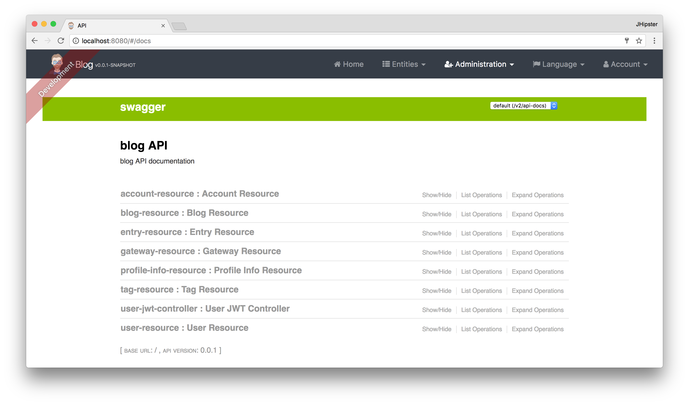

# Develop and Deploy Microservices with JHipster

JHipster is one of those open-source projects you stumble upon and immediately think, "`Of course!`" It combines three 
very successful frameworks in web development: Bootstrap, Angular, and Spring Boot. Bootstrap was one of the first dominant 
web-component frameworks. Its largest appeal was that it only required a bit of HTML and it worked! Bootstrap showed many 
in the Java community how to develop components for the web. It leveled the playing field in HTML/CSS development, much 
like Apple's Human Interface Guidelines did for iOS apps.

At its core, JHipster is a [Yeoman](http://yeoman.io/) generator. Yeoman is a code generator that you run with a `yo` 
command to generate complete applications or useful pieces of an application. Yeoman generators promote what the Yeoman 
team calls the "`Yeoman workflow`". This is an opinionated client-side stack of tools that can help developers quickly 
build beautiful web applications. It takes care of providing everything needed to get working without the normal pains 
associated with a manual setup.

*Learn more about JHipster, including its origin, at [http://jhipster.github.io](http://jhipster.github.io).*

This tutorial shows you how to build a microservices architecture with [JHipster 4.5.4](https://jhipster.github.io/2017/06/16/jhipster-release-4.5.4.html). You'll generate a gateway (powered by Netflix Zuul and the JHipster Gateway), a microservice (that talks to MongoDB), and use Docker Compose to make sure it all runs locally. Then you'll deploy it to Minikube and Google Cloud using Kubernetes.

## Install JHipster 4

The [Installing JHipster](http://jhipster.github.io/installation/) instructions show you all the tools you'll need to 
use a released version of JHipster.

1. Install Java 8 [from Oracle](http://www.oracle.com/technetwork/java/javase/downloads/index.html)
2. Install Git from <https://git-scm.com>
3. Install Node.js from <http://nodejs.org> (I used Node 6.11.0 to write this article)
4. Install Yarn using the [Yarn installation instructions](https://yarnpkg.com/en/docs/install)
5. Run the following command to install [Yeoman](http://yeoman.io/)

    ```
    yarn global add yo
    ```

6. Run the following command to install JHipster

    ```
    yarn global add generator-jhipster
    ```

## Microservices with JHipster 

To build a microservices architecture with JHipster, you'll need to generate two applications and clone another.

* Generate a gateway
* Generate a microservice
* Clone the JHipster Registry

You can see how these components fit in the diagram below.


To see what's happening inside your applications, you can use the [JHipster Console](https://jhipster.github.io/monitoring/#jhipster-console), 
a monitoring tool based on the [ELK Stack](https://www.elastic.co/products). I'll cover JHipster Console in the Docker Compose section.

## Create an API Gateway

To create a microservices project, open a terminal window and create a `jhipster-microservices-example` directory. Then 
create a `blog` directory for the gateway application. 

```bash
mkdir -p jhipster-microservices-example/blog
```

In JHipster terms, a **gateway** is a normal JHipster application. This means you can develop 
it like a monolith, but it also acts as the entrance to your microservices. More specifically, it provides HTTP 
routing and load balancing, quality of service, security, and API documentation for all microservices.

In a terminal, navigate to the `blog` directory and run `jhipster`. 

```bash
cd jhipster-microservices-example/blog
jhipster
```

JHipster prompts you with many questions about the type of application you want to generate and what features you'd like 
to include. Create the `blog` application with the following settings:

* Application type: `Microservice gateway`
* Base name of the application: `blog`
* Port: `8080`
* Default package name: `org.jhipster.blog`
* JHipster Registry: `Yes`
* Type of authentication: `JWT`
* Type of database: `SQL`
* Production database: `PostgreSQL`
* Development database: `H2 with disk-based persistence`
* Maven or Gradle: `Maven`
* Other technologies: `Elasticsearch`
* Client framework: `Angular 4`
* Sass for CSS: `Yes`
* Internationalization support: `Yes`
* Native language: `English`
* Additional languages: `Spanish`
* Testing frameworks: `Gatling, Protractor`
* Install other generators from the JHipster Marketplace: `No`


If you'd like to use the same settings I did, you can place the following `.yo-rc.json` file in the `blog` directory and 
run `jhipster` in it. You won't be prompted to answer any questions because the answers are already in `.yo-rc.json`.

```json
{
  "generator-jhipster": {
    "promptValues": {
      "packageName": "org.jhipster.blog",
      "nativeLanguage": "en"
    },
    "jhipsterVersion": "4.5.4",
    "baseName": "blog",
    "packageName": "org.jhipster.blog",
    "packageFolder": "org/jhipster/blog",
    "serverPort": "8080",
    "authenticationType": "jwt",
    "hibernateCache": "hazelcast",
    "clusteredHttpSession": false,
    "websocket": false,
    "databaseType": "sql",
    "devDatabaseType": "h2Disk",
    "prodDatabaseType": "postgresql",
    "searchEngine": "elasticsearch",
    "messageBroker": false,
    "serviceDiscoveryType": "eureka",
    "buildTool": "maven",
    "enableSocialSignIn": false,
    "jwtSecretKey": "f7450a034a7251b3d201cf5139852f9adf69c2d1",
    "clientFramework": "angular2",
    "useSass": true,
    "clientPackageManager": "yarn",
    "applicationType": "gateway",
    "testFrameworks": [
      "gatling",
      "protractor"
    ],
    "jhiPrefix": "jhi",
    "enableTranslation": true,
    "nativeLanguage": "en",
    "languages": [
      "en",
      "es"
    ]
  }
}
```

The project creation process will take a couple of minutes to run, depending on your internet connection speed. When it's 
finished, you should see output like this:


Before you can run this project, you'll need to download and start an instance of the [JHipster Registry](https://github.com/jhipster/jhipster-registry). 
Run the following commands in the `jhipster-microservices-example` directory.

```bash
git clone git@github.com:jhipster/jhipster-registry.git registry
cd registry && ./mvnw
```

The [JHipster Registry](https://jhipster.github.io/microservices-architecture/#jhipster-registry) is built on Spring 
Cloud Netflix and Spring Cloud Config. Patterns provided by Spring Cloud Netflix include Service Discovery (Eureka),  
Circuit Breaker (Hystrix), Intelligent Routing (Zuul), and Client Side Load Balancing (Ribbon). 

In a new terminal window, navigate to `/jhipster-microservices-example/blog` and run `./mvnw` to start the blog application 
and open <http://localhost:8080> in your favorite browser. The first thing you'll notice is a dapper-looking fellow 
explaining how you can sign in or register.


Sign in with username `admin` and password `admin` and you'll have access to navigate through the Administration section. 
This section offers nice looking UIs on top of some Spring Boot's many monitoring and configuration features. It also 
allows you to administer users:


It gives you insights into Application and JVM metrics:


And it allows you to see the Swagger docs associated with its API.



You can run the following command (in a separate terminal window) to start the Protractor tests and confirm everything is 
working properly.

```bash
yarn e2e
```

At this point, it's a good idea to check your project into Git so you can easily see what changes are made going forward.

```bash
git init
git add .
git commit -m "Gateway created"
```

Shut down your `blog` application before proceeding to the next section.

### Generate Entities

For each entity you want to create, you will need:

* A database table
* A Liquibase change set
* A JPA entity class
* A Spring Data `JpaRepository` interface
* A Spring MVC `RestController` class
* An Angular model, state, component, dialog components, service
* Several HTML pages for each component

Also, you should have integration tests to verify that everything works and performance tests to verify that it runs fast. In an ideal world, you'd also have unit tests and integration tests for your Angular code.

The good news is JHipster can generate all of this code for you, including integration tests and performance tests. In addition, if you have entities with relationships, it will generate the necessary schema to support them (with foreign keys), and the TypeScript and HTML code to manage them. You can also set up validation to require certain fields, as well as control their length.

JHipster supports several methods of code generation. The first uses its [entity sub-generator](https://jhipster.github.io/creating-an-entity/). The entity sub-generator is a command-line tool that prompts you with questions which you answer. [JDL-Studio](https://jhipster.github.io/jdl-studio/) is a browser-based tool for defining your domain model with JHipster Domain Language (JDL). Finally, [JHipster-UML](https://jhipster.github.io/jhipster-uml/) is an option for those that like UML. Supported UML editors include [Modelio](https://www.modeliosoft.com/), [UML Designer](http://www.umldesigner.org/), [GenMyModel](https://www.genmymodel.com/), and [Visual Paradigm](http://www.visual-paradigm.com/). I like the visual nature of JDL-Studio, so I'll use it for this project.

Below is the entity diagram and JDL code needed to generate a simple blog with blogs, entries, and tags.


You can [click on this URL](http://bit.ly/jhipster4-blog-jdl), or copy/paste the contents of the file below to your hard 
drive if you'd like to follow along.

```
entity Blog {
    name String required minlength(3),
    handle String required minlength(2)
}

entity Entry {
    title String required,
    content TextBlob required,
    date ZonedDateTime required
}

entity Tag {
    name String required minlength(2)
}

relationship ManyToOne {
    Blog{user(login)} to User,
    Entry{blog(name)} to Blog
}

relationship ManyToMany {
    Entry{tag(name)} to Tag{entry}
}

paginate Entry, Tag with infinite-scroll
```

Run the following command (in the `blog` directory) to import this file. Running this command will generate entities, tests, and a UI.

```bash
jhipster import-jdl ~/Downloads/jhipster-jdl.jh
```

You'll be prompted to overwrite `src/main/resources/config/liquibase/master.xml`. Type `a` to overwrite this 
file, as well as others.

Start the application with `/.mvnw` and run `yarn start` (in another window) to view the UI for the generated entities. 
Create a couple of blogs for the existing `admin` and `user` users, as well as a few blog entries.


From these screenshots, you can see that users can see each other's data, and modify it.

Now, check your generated entities into Git.

```bash
git init
git add .
git commit -m "Entities generated"
```

### Add Business Logic

TIP: To configure an IDE with your JHipster project, see [Configuring your IDE](https://jhipster.github.io/configuring-ide/). 
Instructions exist for Eclipse, IntelliJ IDEA, Visual Studio Code, and NetBeans.

To add more security around blogs and entries, open `BlogResource.java` and find the `getAllBlogs()` method. Change the 
following line:

```java
List<Blog> blogs = blogRepository.findAll();
```

To:

```java
List<Blog> blogs = blogRepository.findByUserIsCurrentUser();
```

The `findByUserIsCurrentUser()` method is generated by JHipster in the `BlogRepository` class and allows limiting results 
by the current user.

```java
public interface BlogRepository extends JpaRepository<Blog,Long> {

    @Query("select blog from Blog blog where blog.user.login = ?#{principal.username}")
    List<Blog> findByUserIsCurrentUser();

}
```

After making this change, re-compiling `BlogResource` should trigger a restart of the application thanks to 
[Spring Boot's Developer tools](http://docs.spring.io/spring-boot/docs/current/reference/html/using-boot-devtools.html). 
If you navigate to <http://localhost:9000/blogs>, you should only see the blog for the current user.


To add this same logic for entries, open `EntryResource.java` and find the `getAllEntries()` method. Change the following line:

```java
Page<Entry> page = entryRepository.findAll(pageable);
```

To:

```java
Page<Entry> page = entryRepository.findByBlogUserLoginOrderByDateDesc(SecurityUtils.getCurrentUserLogin(), pageable);
```

Using your IDE, create this method in the `EntryRepository` class. It should look as follows:

```java
Page<Entry> findByBlogUserLoginOrderByDateDesc(String currentUserLogin, Pageable pageable);
```

Recompile both changed classes and verify that the `user` user only sees the entries you created for them.


After making this changes, commit them to Git.

```
git add .
git commit -m "Add business logic"
```

You might notice that this application doesn't look like a blog and it doesn't allow HTML in the content field.

### Make UI Enhancements

When doing UI development on a JHipster-generated application, it's nice to see your changes as soon as you save a file. 
JHipster 4 uses [Browsersync](https://www.browsersync.io/) and [webpack](https://webpack.github.io/) to power this feature. 
You enable this previously by running the following command in the `blog` directory.

```bash
yarn start
```

In this section, you'll change the following:

1. Change the rendered content field to display HTML
2. Change the list of entries to look like a blog

#### Allow HTML

If you enter HTML in the `content` field of a blog entry, you'll notice it's escaped on the list screen.


To change this behavior, open `entry.component.html` and change the following line:

```html
<td>{{entry.content}}</td>
```

To:

```html
<td [innerHTML]="entry.content"></td>
```

After making this change, you'll see that the HTML is no longer escaped.

[HTML in entries](static/entries-with-html.png)

#### Improve the layout

To make the list of entries look like a blog, replace `<div class="table-responsive">` with HTML, so it uses a stacked layout in a single column.

```html
<div class="table-responsive" *ngIf="entries">
    <div infinite-scroll (scrolled)="loadPage(page + 1)" [infiniteScrollDisabled]="page >= links['last']"
         [infiniteScrollDistance]="0">
        <div *ngFor="let entry of entries; trackBy: trackId">
            <h2>{{entry.title}}</h2>
            <small>Posted on {{entry.date | date: 'short'}} by {{entry.blog.user.login}}</small>
            <div [innerHTML]="entry.content"></div>
            <div class="btn-group mb-4 mt-1">
                <button type="submit"
                        [routerLink]="['/', { outlets: { popup: 'entry/'+ entry.id + '/edit'} }]"
                        replaceUrl="true"
                        class="btn btn-primary btn-sm">
                    <span class="fa fa-pencil"></span>
                    <span class="hidden-md-down" jhiTranslate="entity.action.edit">Edit</span>
                </button>
                <button type="submit"
                        [routerLink]="['/', { outlets: { popup: 'entry/'+ entry.id + '/delete'} }]"
                        replaceUrl="true"
                        class="btn btn-danger btn-sm">
                    <span class="fa fa-remove"></span>
                    <span class="hidden-md-down" jhiTranslate="entity.action.delete">Delete</span>
                </button>
            </div>
        </div>
    </div>
</div>
```

Now it looks more like a regular blog!


Commit all your changes to Git.

```
git add .
git commit -m "UI enhancements"
```

## Create a Microservice

To generate a `store` microservice, open a terminal window and navigate to the `jhipster-microservices-example` directory.
Create a `store` directory and run `jhipster` in it. Use the following settings to generate a microservice that uses 
MongoDB for its database.

* Application type: `Microservice application`
* Base name of the application: `store`
* Port: `8081`
* Default package name: `org.jhipster.store`
* Type of authentication: `JWT`
* Use JHipster Registry: `Yes`
* Type of database: `MongoDB`
* Maven or Gradle: `Maven`
* Other technologies: `None`
* Internationalization support: `Yes`
* Native language: `English`
* Additional languages: `Spanish`
* Testing frameworks: `Gatling`
* Install other generators from the JHipster Marketplace: `No`


The `.yo-rc.json` created by this process is as follows:

```json
{
  "generator-jhipster": {
    "promptValues": {
      "packageName": "org.jhipster.store",
      "nativeLanguage": "en"
    },
    "jhipsterVersion": "4.5.4",
    "baseName": "store",
    "packageName": "org.jhipster.store",
    "packageFolder": "org/jhipster/store",
    "serverPort": "8081",
    "authenticationType": "jwt",
    "hibernateCache": "no",
    "clusteredHttpSession": false,
    "websocket": false,
    "databaseType": "mongodb",
    "devDatabaseType": "mongodb",
    "prodDatabaseType": "mongodb",
    "searchEngine": false,
    "messageBroker": false,
    "serviceDiscoveryType": "eureka",
    "buildTool": "maven",
    "enableSocialSignIn": false,
    "jwtSecretKey": "ea21b5b635606be4d7937e29926166e0ee56abb1",
    "enableTranslation": true,
    "applicationType": "microservice",
    "testFrameworks": [
      "gatling"
    ],
    "jhiPrefix": "jhi",
    "skipClient": true,
    "skipUserManagement": true,
    "nativeLanguage": "en",
    "languages": [
      "en",
      "es"
    ],
    "clientPackageManager": "yarn"
  }
}
```

Commit your changes to Git. It's always a good idea to do this before generating entities.

```bash
cd ~/jhipster-microservices-example/
git add store
git commit -m "Generate store application"
```

### Generate Product Entity

Create a product entity by running the following command in the `store` directory.

```bash
jhipster entity product
```

Use the following answers for the questions asked:

* Do you want to add a field to your entity? `Yes`
* What is the name of your field? `name`
* What is the type of your field? `String`
* Do you want to add validation rules to your field? `Yes`
* Which validation rules do you want to add? `Required`

* Do you want to add a field to your entity? `Yes`
* What is the name of your field? `price`
* What is the type of your field? `BigDecimal`
* Do you want to add validation rules to your field? `Yes`
* Which validation rules do you want to add? `Required`

* Do you want to add a field to your entity? `No`

* Do you want to use a Data Transfer Object (DTO)? `No`
* Do you want to use separate service class for your business logic? `No`
* Do you want pagination on your entity? `Yes, with pagination links`

Your terminal should look similar to the following after you've answered all these questions.


### Generate UI for Product Entity

A microservice only contains the server-side code for the entities it contains. To generate
an Angular UI for the product, navigate to the `blog` directory and run the same command.

```bash
jhipster entity product
```

Use the following answers to the questions asked:

* Do you want to generate this entity from an existing microservice? `Yes`
* Enter the path to the microservice root directory: `../store`
* Do you want to update the entity? `Yes`

A visual of these questions and answers is in the screenshot below.


Commit your changes to Git.

```
cd ~/jhipster-microservices-example
git add .
git commit -m "Add product entity"
```

At this point, you should be able to verify everything works by starting the registry, blog, store, and MongoDB.
You can run MongoDB using Docker Compose with the following command in the `store` directory. You'll need to have Docker installed and running for this command to work.

```bash
docker-compose -f src/main/docker/mongodb.yml up
```

The [Docker Compose](#docker-compose) section shows how you can run all your services using Docker.

Navigate to `http://localhost:8080`, log in with admin/admin, and go to Entities > Product. You should be able to
add a product and see that it has a MongoDB identifier.


## Build for Production

A JHipster application can be deployed anywhere a Spring Boot application can be deployed. Its Angular client is
bundled inside its JAR files. JHipster ships with support for deploying to [Cloud Foundry](https://jhipster.github.io/cloudfoundry/), [Heroku](https://jhipster.github.io/heroku/), [Kubernetes](https://jhipster.github.io/kubernetes/), [AWS](https://jhipster.github.io/aws/), and [AWS with Boxfuse](https://jhipster.github.io/boxfuse/). 

When you prepare a JHipster application for production, it's recommended to use the pre-configured "`production`" profile. 
With Maven, you can package your application by specifying the `prod` profile when building.

```bash
./mvnw -Pprod package
```

The production profile is used to build an optimized JavaScript client. You can invoke this using webpack by running 
`yarn run webpack:prod`. The production profile also configures gzip compression with a servlet filter, cache headers, 
and monitoring via [Metrics](https://github.com/dropwizard/metrics). If you have a [Graphite](http://graphite.wikidot.com/) 
server configured in your `application-prod.yml` file, your application will automatically send metrics data to it.

When you run this command in the `blog` application, you'll likely get a test failure.

```
Results :

Failed tests:
  BlogResourceIntTest.getAllBlogs:184 Status expected:<200> but was:<500>

Tests run: 157, Failures: 1, Errors: 0, Skipped: 0
```

The reason this happens is shown in a stack trace in your terminal.

```
Running org.jhipster.blog.web.rest.BlogResourceIntTest
2017-06-19 10:29:17.288 ERROR 4168 --- [           main] o.j.b.w.rest.errors.ExceptionTranslator  
: An unexpected error occured: Authentication object cannot be null; nested exception is 
java.lang.IllegalArgumentException: Authentication object cannot be null
2017-06-19 10:29:17.472 ERROR 4168 --- [           main] o.j.blog.web.rest.util.HeaderUtil        
: Entity processing failed, A new blog cannot already have an ID
```

To fix this, you can use Spring Security Test's [`@WithMockUser`](http://docs.spring.io/spring-security/site/docs/current/reference/html/test-method.html#test-method-withmockuser). Open `BlogResourceIntTest.java` and inject  `UserRepository` as a dependency.

```java
@Autowired
private UserRepository userRepository;
```

Change the `createEntity()` method, so it's not `static` and uses the `userRepository` to set a user on the blog entity.

```java
public Blog createEntity(EntityManager em) {
    Blog blog = new Blog()
            .name(DEFAULT_NAME)
            .handle(DEFAULT_HANDLE)
            .user(userRepository.findOneByLogin("user").get());
    return blog;
}
```

Add `@WithMockUser` to the `getAllBlogs()` method.

```java
@Test
@Transactional
@WithMockUser
public void getAllBlogs() throws Exception {
```

Commit your changes to Git.

```
git add .
git commit -m "Fix tests"
```

After fixing this test, you should be able to run `./mvnw -Pprod package` without any failures. You might notice that
this does take quite some time, mostly due to the Webpack build and optimizations. Below is the output from a Mid 2015
MacBook Pro with 16GB of RAM and JAVA_OPTS set to `-Xmx2048m`.

```bash
[INFO] ------------------------------------------------------------------------
[INFO] BUILD SUCCESS
[INFO] ------------------------------------------------------------------------
[INFO] Total time: 04:38 min
[INFO] Finished at: 2017-06-19T10:39:09-06:00
[INFO] Final Memory: 75M/747M
[INFO] ------------------------------------------------------------------------
```

## Deploy to the Cloud

What good is a microservices architecture if it's not deployed to a PaaS (Platform as a Service)?! PaaS providers
are also known as "the cloud", and allow you to deploy and scale microservices as needed. Docker provides
a mechanism to "package" your applications as an entire bundle. A Docker container includes the operating system and 
services needed to run your application. Often, Docker containers are used for the individual components of your 
architecture. For example, you'll have a Docker container for each app, as well as one for PostgreSQL, MongoDB, and
Elasticsearch.

To complete this section, you'll need to [install Docker](https://docs.docker.com/engine/installation/).

**NOTE:** If you're not on Mac or Windows, you may need to [install Docker Compose](https://docs.docker.com/compose/install/) as well.

<a name="docker-compose"></a>

### Run with Docker Compose

Docker Compose is a tool for defining and running multi-container Docker applications. With Compose, you can create and 
start all the components of your application with a single command.

1. Make sure Docker is running
2. Build Docker images for the `blog` and `store` applications by running the following command in both directories:

    ```
    ./mvnw package -Pprod docker:build
    ```
    
3. Using your terminal, navigate to the root directory of your project, and create a `docker` directory. Then run the 
[JHipster Docker Compose sub-generator](https://jhipster.github.io/docker-compose/#docker-compose-subgen) in it.

    ```
    jhipster docker-compose
    ````
    
    * Application type: `Microservice application`
    * Root directory of your microservices: `../`
    * Applications to include: `blog` and `store`
    * Applications with clustered databases: `None`
    * Set up monitoring: `JHipster Console with ELK/Zipkin`
    * The admin password for the JHipster Registry: `admin`
    
    
    
4. Run `docker-compose up` to run all your services and see the logs in the same window. Add `-d` if you want to run 
them as a daemon
    
5. Use [Kitematic](https://kitematic.com/) to view the ports and logs for the services deployed


You can view the JHipster Registry at <http://localhost:8761>.

To produce data for the JHipster Console to display, run some Gatling tests in the `blog` app.

```bash
./mvnw gatling:execute
```

These simulations can take a while (> 10m) to complete. When they're finished, you can view their pretty reports.


You can see the JHipster Console at <http://localhost:5601>. Navigate to Dashboards > Open to display some pre-built 
dashboards for the JVM, logs, metrics, microservices, and performance. The screenshots below show you what some of 
these look like.

<table style="width: 100%">
<tr>
<td><a href="static/dashboard-jvm.png"></a></td>
<td><a href="static/dashboard-metrics.png"></a></td>
</tr>
<tr>
<td><a href="static/dashboard-microservices.png"></a></td>
<td><a href="static/dashboard-performance.png"></a></td>
</tr>
</table>

To save your changes for Docker Compose, commit your changes to Git.

```
git add .
git commit -m "Add Docker Compose"
```

### Run with Kubernetes and Minikube

[Kubernetes](https://kubernetes.io/) is an open-source system for automating deployment, scaling, and management of 
containerized applications. It was developed at Google over the last 16 years and was internally called Borg. To deploy
Docker containers with Kubernetes, you set up a cluster, then deploy to it. The context can be local (with Minikube), or 
remote (e.g. a Raspberry Pi cluster, Google Cloud, AWS, OpenShift, etc.).

Follow the steps below to use Kubernetes to deploy to a local cluster.

1. Install [kubectl](https://kubernetes.io/docs/tasks/kubectl/install/), [VirtualBox](https://www.virtualbox.org/wiki/Downloads)
and [Minikube](https://github.com/kubernetes/minikube/releases)
2. Start Minikube using `minikube start`
3. To be able to work with the docker daemon, run the following command in your terminal:

   ```bash
   eval $(minikube docker-env)
   ```
  
4. Create Docker images of the `blog` and `store` applications:
   
    ```bash
    ./mvnw package -Pprod docker:build
    ```
      
5. Using your terminal, navigate to the root directory of your project, and create a `kubernetes` directory. Then run the 
[JHipster Kubernetes sub-generator](https://jhipster.github.io/kubernetes/) in it.

    ```
    jhipster kubernetes
    ````
    
    * Application type: `Microservice application`
    * Root directory of your microservices: `../`
    * Applications to include: `blog` and `store`
    * The admin password for the JHipster Registry: `admin`
    * Kubernetes namespace: `default`
    * Base Docker repository name (e.g. `mraible`): `<your-docker-hub-username>`
    * Command to push Docker image to repository: `docker push`
    
    
  
6. Run the following commands to tag your Docker images. The Kubernetes sub-generator says to run `docker push` as well, 
but you don't need that for a Minikube deployment.

    ```bash
    docker image tag blog mraible/blog
    docker image tag store mraible/store
    ```
    
7. Run the following commands in the `kubernetes` directory to deploy to Minikube. 

    ```
    kubectl apply -f registry
    kubectl apply -f blog
    kubectl apply -f store
    ```
    
    The deployment process can take several minutes to complete. Run `minikube dashboard` to see the deployed containers.
    
    
    
    You can also run `kubectl get po -o wide --watch` to see the status of each pod.

8. Run `minikube service blog` to view the blog application. You should be able to login and add blogs, entries, and products.

To remove all deployed containers, run the following command:

    kubectl delete deployment --all
    
To stop Minikube, run `minikube stop`.

To save your changes for Kubernetes, commit your changes to Git from the top-level directory.

```
git add .
git commit -m "Kubernetes"
```

### Deploy to Google Cloud

Google Cloud is a PaaS that's built on Google's core infrastructure. It's one of the easiest providers to support Kubernetes. 
Complete the steps below to deploy your hip microservices to Google Cloud. If you completed the Minikube section above, open 
a new terminal window to reset things.

1. Create a Google Cloud project at [console.cloud.google.com](https://console.cloud.google.com/)
2. Navigate to <https://console.cloud.google.com/kubernetes/list> to initialize the Container Engine for your project 
3. Install [Google Cloud SDK](https://cloud.google.com/sdk/) and set project using:
  
       gcloud config set project <project-name>

4. Create a cluster:
  
       gcloud container clusters create <cluster-name> --machine-type=n1-standard-2 --scopes cloud-platform --zone us-west1-a
       
   To see a list of possible zones, run `gcloud compute zones list`.
   
5. Push the `blog` and `store` docker images to [Docker Hub](https://hub.docker.com/). You will need to create an account 
and run `docker login` to push your images. The images can be run from any directory.

    ```bash
    docker image tag blog mraible/blog
    docker push mraible/blog
    docker image tag store mraible/store
    docker push mraible/store
    ```

6. Run `kubectl` commands to deploy

    ```bash
    kubectl apply -f registry
    kubectl apply -f blog
    kubectl apply -f store
    ```

7. Use port-forwarding to see the registry app locally

       kubectl port-forward jhipster-registry-0 8761:8761
    
8. Run `kubectl get service blog` to get the external IP of the blog application on Google Cloud. Open 
`http://<external-ip>:8080` to view your running application and verify everything works.

9. Scale microservice apps as needed with `kubectl`:

       kubectl scale --replicas=3 deployment/store
       
Did you get everything working? If so, you rock! You've built a production-ready microservices scaffold for your application with JHipster!

## Source Code and Screencast

The source code for this tutorial is [available on GitHub](https://github.com/oktadeveloper/jhipster-microservices-example). 
See its [README](https://github.com/oktadeveloper/jhipster-microservices-example) if you simply want to clone the project
and run it. Or, you can [watch a screencast of building microservices with JHipster and deploying to Google Cloud](https://youtu.be/dgVQOYEwleA).

<div style="max-width: 560px; margin: 0 auto">
<iframe width="560" height="315" src="https://www.youtube.com/embed/dgVQOYEwleA?ecver=1" frameborder="0" allowfullscreen></iframe>
</div>

## Learn More about JHipster and Microservices

I hope you've enjoyed learning how JHipster can help you develop hip microservice architectures! It's a nifty project, with an easy-to-use entity generator, a beautiful UI, and many Spring Boot best-practice patterns. If you have features you'd 
like to add or if you'd like to refine existing features, you can [watch the project on GitHub](https://github.com/jhipster/generator-jhipster) and [help with its development](https://github.com/jhipster/generator-jhipster/blob/master/CONTRIBUTING.md) and support. We're always looking for help!

If you have questions about JHipster, please [hit me up on Twitter](https://twitter.com/mraible) or post a question to 
Stack Overflow with the ["jhipster" tag](http://stackoverflow.com/questions/tagged/jhipster).

If you're interested in learning more about microservices, you might also find the following resources useful:

* [Doing Microservices with JHipster](https://jhipster.github.io/microservices-architecture/)
* [Build a Microservices Architecture for Microbrews](/blog/2017/06/15/build-microservices-architecture-spring-boot)
* [Bootstrapping Your Microservices Architecture with JHipster and Spring](https://blog.heroku.com/bootstrapping_your_microservices_architecture_with_jhipster_and_spring)
* [Microservice Resources from Chris Richardson](http://microservices.io/resources/index.html)
